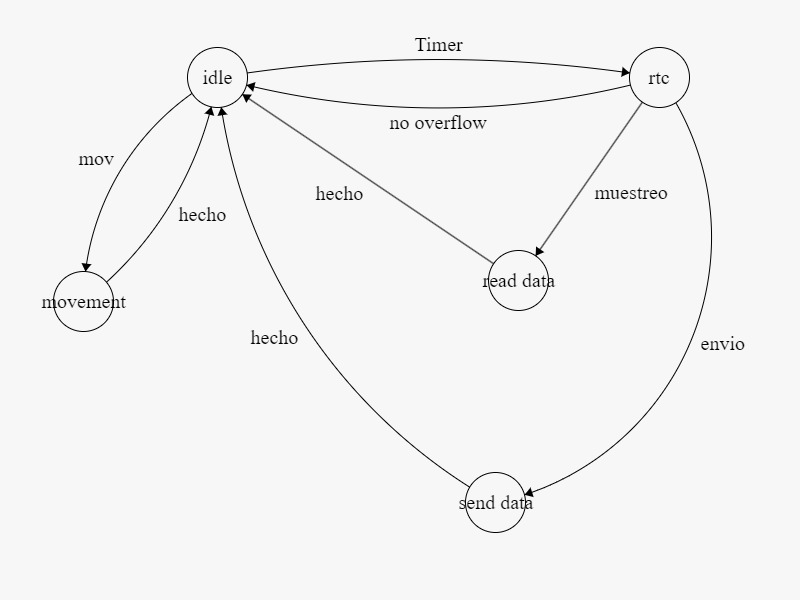

# BeaconCell

## Description
IOT cellular beacon implementation using BG95 and LGT8F328P

****IMPORTANT TO DO:** 
1. Check power down mode in microcontroller (doesnt work at the same time with accelerometer)
2. Add Adafruit IO key in bg95_mqtt.c but never post it to GitHub.
3. Change cloud feeds names (mqtt topics) in state_machine.c, and main.c
4. Setup APN in bg95_init function. Some used so far: internet.itelcel.com, m2m.tele2.com, internet.oxio.com

### Functionalities

- GNSS location
- MQTT (SSL) cloud communication
- UART between chip and LTE module
- Motion detection (MXC4005XC)

### Implementation
State machine control
***NOTE:** state "movimiento" is unused because of MXC4005XC's ISR

## Public Methods

### StateMachine.c

* [void computeStateMachine(void)](#computeStateMachine)
* [void computeStateMachine_fake(void)](#computeStateMachine_fake)
* [void sendATCommands(char *)](#sendATCommands)
* [void iluminacion(void)](#iluminacion)
* [void temperatura(void)](#temperatura)
* [void GPS(void)](#GPS(void))
* [void TRY_COMMAND(char *, char *, size_t)](#TRY_COMMAND)
* [bool handle_Response(char *buffer, size_t buffersize)](#handle_Response)
* [bool handleErrorCode(char *, size_t)](#handleErrorCode)

### DrvUSART.c

* [void DrvUSART_Init(void)](#Init)
* [void DrvUSART_SendChar(u8 u8Char)](#DrvUSART_SendChar)
* [void DrvUSART_SendStr(char* str)](#DrvUSART_SendStr)
* [void processData(char *, size_t)](#processData)
* [void processData_wait(char *, size_t)](#processData_wait)

### MXC4005XC.c

* [void MXC4005XC_init(void)](#MXC4005XC_init)
* [u8 LeeMXC4005XC_NI(u8 regAddr)](#LeeMXC4005XC_NI)
* [void EscribeMXC4005XC_NI(u8 regAddr, u8 data)](#EscribeMXC4005XC_NI)
* [void MXC4005XC_GetData_test(float *data)](#MXC4005XC_GetData_test)
* [void MXC4005XC_GetData_real(float *data)](#MXC4005XC_GetData_real)
* [float MXC4005XC_Get_Temperature(void)](#MXC4005XC_Get_Temperature)
* 

### ErrorHandling.c

* [bool handleMoveOn(void)](#handleMoveOn)
* [bool handleRetry(void)](#handleRetry)
* [bool handleNoErrorCode(void)](#handleNoErrorCode)
* [bool handle505(void)](#handle505)
* [bool handleconnection(char *buffer, size_t buffersize)](#handleconnection)

### bg95MQTT.c

* [bool mqtt_init(void)](#mqtt_init)
* [void mqtt_pub_str(const char *topic, const char *message)](#mqtt_pub_str)
* [void mqtt_pub_char(const char *topic, const char message)](#mqtt_pub_char)
* [void mqtt_pub_unsigned_short(const char *topic, unsigned short message)](#mqtt_pub_unsigned_short)
* [void mqtt_pub_float(const char *topic, const float message)](#mqtt_pub_float)
* [void mqtt_pub_int(const char *topic, const int message)](#mqtt_pub_int)
* [void mqtt_disconnect(void)](#mqtt_disconnect)

# Public Methods - Extension

## DrvUSART.c

1. ### Init
	* Autogen USART registers and ports initializer. Check macros.h for enabling/disabling interruptions
2. ### DrvUSART_SendChar
	&nbsp;&ensp;&ensp; ***NOT USING INTERRUPTION***
	* Busy waits until USART data register is empty, then writes received char into UDR0
3. ### DrvUSART_SendStr
	&nbsp;&ensp;&ensp; ***NOT USING INTERRUPTION***
	* Receives array pointer and for each char it calls DrvUSART_SendChar.
6. ### processData
	&nbsp;&ensp;&ensp; ***USING INTERRUPTION***
	* COMMENTED POINTER LINES:
	Function to handle responses with and without echoed command.
	Receives pointer to linear array (char) and fills it with zeros
	Pointer to first char of actual received response in rxBuffer
	compares pointer to last Command, if last Command was found it skips it
	* ACTUAL USE: Stores characters received in serial port which are sent by BG95, Copies each char into received array and updates rxReadPos.
7. ### processData_wait
	* If Rx buffer is empty, wait timeout_ms for a response (Used for connection commands which take more time to respond)
	* Copies each char into received array and updates rxReadPos.

## state_machine.c

1.  ### computeStateMachine
	* call it to enter state machine. Muestreo Samples data, Envio sends to cloud, Dormido is Idle. Turns off after each state. It enters according to counters in ISR from Watchdog Timer.

2. ### computeStateMachine_fake
	* Tryout state machine for debugging, not turning off the module and not disconnecting from mqtt (several versions for different debugging).
2. ### sendATCommands
	* For testing and debugging, not used much. It calls DrvUSART_SendStr to send a command and DrvUSART_GetString to print it on the LCD
3. ### iluminacion
	* Obtains the light read from ALS-PT19 sensor 
4. ### temperatura
	* not implemented yet
5. ### GPS
	* Enters location data retrieving routine, enables GNSS, then calls the function TRY_COMMAND to try and get fix and store location in COORDS, if there was a fix before, but none after, it stores the old coordinates.
8. ### TRY_COMMAND
	* receives a command and an array to store response, tries a command multiple times and handles specific errors if failed (not implemented yet). If command was successful it breaks
9. ### handle_Response
	* OK or ERROR handling with switch case. Will be changed to dictionary structure for error specific
10. ### handleErrorCode
	* different implementation of handle response with struct and error codes array (check error_handling.c)

## MXC4005XC.c

1. ### MXC4005XC_init
	* Initializes the Interrupt port to falling edge and powers up accelerometer setting interrupt mask, detection and sensitivity.
2. ### LeeMXC4005XC_NI
	* I2C Read routine specific for MXC4005XC.
3. ### EscribeMXC4005XC_NI
	* I2C Write routine specific for MXC4005XC
4. ### MXC4005XC_GetData_real
	* Retrieves and processes accelerometer data from the MXC4005XC sensor, returning the actual accelerations and temperature in Celsius.
5. ### MXC4005XC_Get_Temperature
	* Reads and returns only the temperature data from the MXC4005XC sensor.

## ErrorHandling.c
1. ### handleMoveOn
	* Returns True.
2. ### handleRetry
	* Returns False.
3. ### handleNoErrorCode
	* handles ERROR according to lastCommand for all types of errors (without code) including mqtt.
4. ### handle505
	* Handles GPS turning on or off.
5. ### handleconnection
	* Handles connection errors.

## bg95MQTT.c
1. ### mqtt_init
	* LTE priority, SSL, PDP and MQTT Open and Connect.
2. ### mqtt_pub_str
	* Publishes a string message to the specified MQTT topic.
3. ### mqtt_pub_char
	* Publishes a character message to the specified MQTT topic.
4. ### mqtt_pub_unsigned_short
	* Publishes an unsigned short message to the specified MQTT topic.
5. ### mqtt_pub_float
	* Publishes a float message to the specified MQTT topic. Note: manual making of a float (integer part and fractional part).
6. ### mqtt_pub_int
	* Publishes an integer message to the specified MQTT topic.
7. ### mqtt_disconnect
	* Disconnects from the MQTT broker and deactivates context.

## Resources and Notes

### PCB antennas
* Molex varias opciones
https://www.google.com/url?sa=i&url=https%3A%2F%2Fwww.molex.co.th%2Fcontent%2Fdam%2Fmolex%2Fmolex-dot-com%2Fen_us%2Fpdf%2Fdatasheets%2Fgnss-antennas_ds_en-987651-5071.pdf&psig=AOvVaw2SxkOk_Co8FEA5opqKdM85&ust=1720828434945000&source=images&cd=vfe&opi=89978449&ved=0CAQQn5wMahcKEwio-tz3l6CHAxUAAAAAHQAAAAAQBA
https://www.molex.com/en-us/products/part-detail/2065600050
https://www.molex.com/content/dam/molex/testing/pcp/Standard%20Antennas.pdf?inline
* YC0013AA
https://www.digikey.com.mx/en/products/detail/quectel/YC0013AA/15706710
* 1004259 – GPS / GLONASS / GNSS Ceramic Patch Antenna (Active)
https://www.kyocera-avx.com/product/gps-glonass-ceramic-patch-antenna-active-1004259/
* YG0062AA
https://www.mouser.mx/ProductDetail/Quectel/YG0062AA?qs=QNEnbhJQKvZQB9RTVp%252B88w%3D%3D&mgh=1&vip=1&utm_id=17633969509&gad_source=1&gclid=Cj0KCQjwv7O0BhDwARIsAC0sjWP6Ht4U0aBaGxAZfOYmbwAUrw4FhI6se1dsYJhRt-Cf92TVO6nSZlkaApY1EALw_wcB
* 206640-0001
https://www.mouser.mx/ProductDetail/Molex/206640-0001?qs=wQWKWGyrjFn4T%2FbNfM6cBQ%3D%3D&mgh=1&vip=1&utm_id=17633969509&gad_source=1&gclid=Cj0KCQjwv7O0BhDwARIsAC0sjWOccV6c9ailu2SqT5_0FgPUEcwUsPVi3XD65BUQElLc4wG4euWo3U4aAnGaEALw_wcB
* YC0013AA
https://www.mouser.mx/ProductDetail/Quectel/YC0013AA?qs=7D1LtPJG0i3qgrXnHwxS8Q%3D%3D
* 4G+GPS PCB Flexible Antenna With 1.13mm Cable (L-10cm) + UFL Connector
https://eteily.com/flexible-pcb-antenna/974-1288-4ggps-pcb-flexible-antenna-with-113mm-cable-l-10cm-ufl-connector.html#/11-color-black/30-product_type-antenna/40-antenna_type-embedded/45-antenna_mounting-pcb_mount/71-antenna_technology-gps_l1/181-antenna_type-flexible_pcb_antenna
* GPS PCB Flexible Antenna With 1.13mm Cable (L-10cm) + UFL Connector
https://eteily.com/flexible-pcb-antenna/992-1325-gps-pcb-flexible-antenna-with-113mm-cable-l-10cm-ufl-connector.html#/11-color-black/30-product_type-antenna/40-antenna_type-embedded/45-antenna_mounting-pcb_mount/71-antenna_technology-gps_l1/170-antenna_frequency-157542mhz/181-antenna_type-flexible_pcb_antenna

### Notes:
* blinking fast means connecting to mqtt
* blinking slow off fast on means no network
* blinking fast off, slow on means connected to network
* Important to setup APN for LTE connection.
Some Resources:
https://www.mcc-mnc.com/
https://www.numberingplans.com/?page=analysis&sub=imsinr
* Change counter values on WDT ISR (main.c) for frequency of state change
* Multiple commands can be placed on a single line using a semi-colon (;) between commands. Only the first command should have AT prefix. Commands can be in upper or lower case.
* Send delay (1 second) between each mqtt publish command
* processdata_wait relies con interruptions so dont disable them.
* GPS takes at least 18 seconds (tries 5 times with a 3 second wait for finding a fix)
* Add Adafruit IO key in bg95_mqtt.c
* code the error functions URCs for mqtt in error_handling
* handle when there is no service (reiniciar bg95 o algo)
* +QMTOPEN: 0,3 debug this PDP
* Logic for counting when the door was opened and check if its open or closed.
* Add state for repairing connection with a 5-10 minute timeout to save battery.

- Accelerometer Interrupt (Pin 32 PD2)
- RXD (pin 30 PD0)
- TXD (pin 31 PD1)
- BG95 works at baud rate: 115200

* Antena chiquita no sirve?
